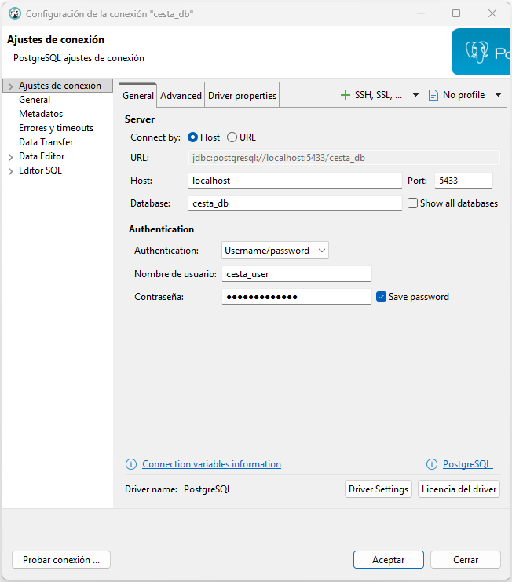
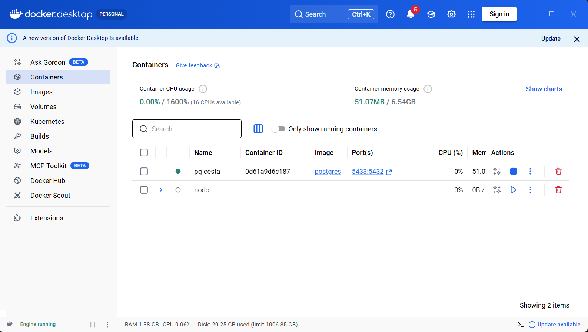
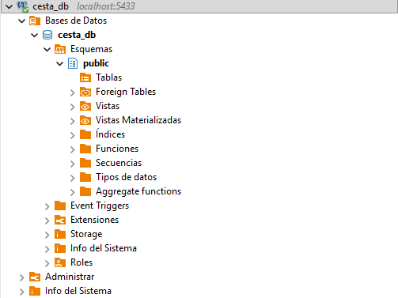
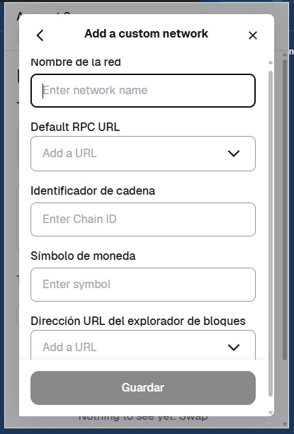
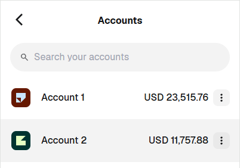
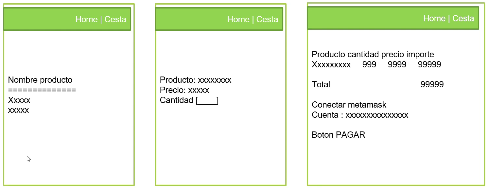
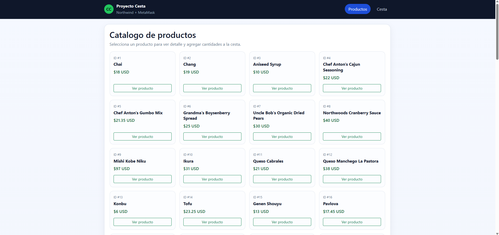
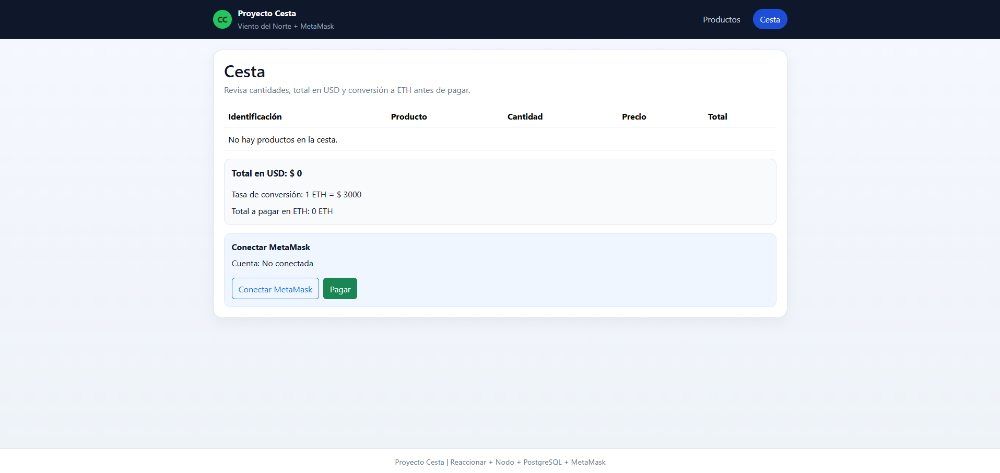
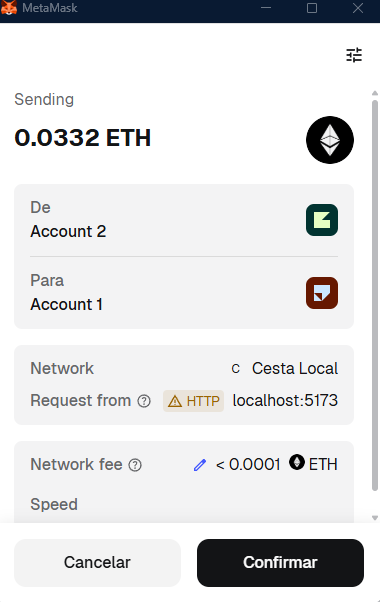
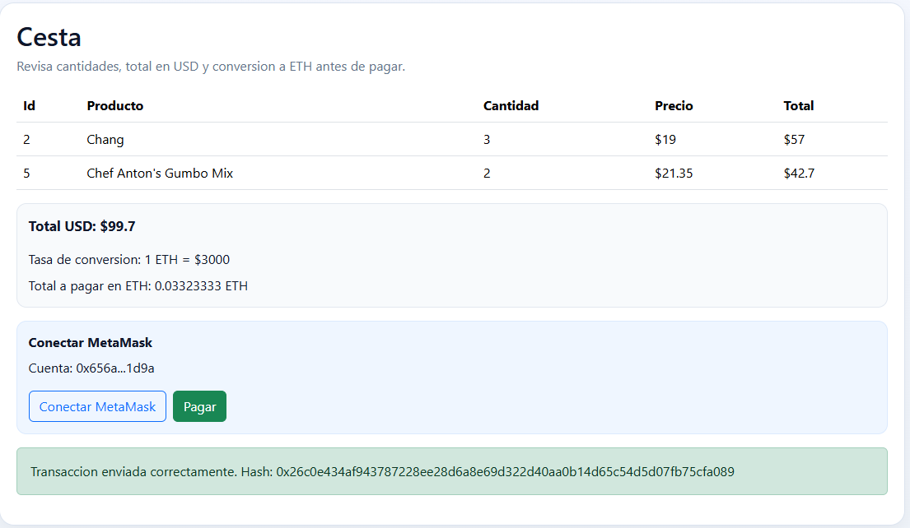

# PROYECTO CESTA

Aplicacion web para construir y gestionar una cesta de compra usando productos de la base de datos **Northwind**, con pago en **ETH** mediante **MetaMask** y un proveedor local en Docker.

## Datos del proyecto

- Nombre: Luis Prado
- Academia: Code Crypto Academy
- Profesor: Jose Viejo

## Estado actual

Proyecto completado en entorno local, incluyendo:

- Frontend React con rutas (`Home`, `Detalle`, `Cesta`) y estado global de carrito.
- Backend Node/Express conectado a PostgreSQL Northwind.
- Red Ethereum local con Geth + MetaMask para pagos de prueba.
- Pago en ETH con conversion desde USD y validaciones de cuenta.

## Indicaciones base (alcance funcional)

1. Construir una cesta de la compra con productos de la base de datos Northwind.
2. Tener una pagina Home con la lista de productos.
3. Tener una pagina de detalle de producto.
4. En la pagina de producto se podra definir la cantidad.
5. Tener una pagina para presentar la cesta.
6. En la pagina de cesta se podra cambiar cantidad e ir al detalle del producto.
7. Tener una cabecera con navegacion a cesta y lista de productos.
8. Permitir pago con ETH mediante MetaMask y un proveedor local levantado con Docker.

## Stack inicial

- React 19
- Vite 8
- ESLint 9

## Comandos

```bash
npm install
npm run dev
```

## Comandos para subir a GitHub

Repositorio remoto:

- [https://github.com/luisprado119/PROYECTO_CESTA.git](https://github.com/luisprado119/PROYECTO_CESTA.git)

Si el proyecto aun no esta inicializado con Git en tu carpeta local:

```bash
git init
git branch -M main
git remote add origin https://github.com/luisprado119/PROYECTO_CESTA.git
```

Para subir por primera vez:

```bash
git add .
git commit -m "feat: proyecto cesta completo con frontend, backend y pago metamask"
git push -u origin main
```

Para siguientes actualizaciones:

```bash
git add .
git commit -m "chore: actualizacion del proyecto"
git push
```

Comandos utiles de verificacion antes de subir:

```bash
git status
git remote -v
```

## Guia tutorial (inicio a fin)

Este bloque resume el flujo completo, sin omitir pasos criticos.

1. Preparar entorno de variables: copiar `.env.example` -> `.env` y completar valores locales.
2. Levantar PostgreSQL en Docker y crear la base de trabajo.
3. Importar `db/scripts/northwind.postgres.sql` desde DBeaver.
4. Levantar backend con `npm run server` y verificar `/ping`, `/health`, `/products`.
5. Crear/actualizar `blockchain/genesis.json` con `chainId: 1337`, `clique` y `alloc`.
6. Crear cuenta firmante local en Geth (`account new`) y colocarla como firmante en `extradata`.
7. Inicializar cadena con `init` y arrancar Geth con:
   - `--unlock <SIGNER>`
   - `--password /blockchain/password.txt`
   - `--mine`
   - `--miner.etherbase <SIGNER>`
8. Validar RPC:
   - `eth_chainId = 0x539`
   - `eth_mining = true`
   - `eth_blockNumber` aumentando
9. En MetaMask:
   - agregar red `Cesta Local`
   - conectar manualmente desde la app
   - elegir una cuenta diferente a la cuenta comercio para pagar
10. En la app:
    - agregar productos a cesta
    - verificar total USD y total ETH
    - pagar y confirmar hash / receipt

Comandos operativos principales:

```bash
# Frontend
npm run dev

# Backend
npm run server

# Inicializar genesis en datadir limpio
docker run --rm -v "${PWD}\blockchain\data-poa2:/data" -v "${PWD}\blockchain:/blockchain" ethereum/client-go:v1.13.15 --datadir /data init /blockchain/genesis.json

# Crear firmante local
docker run --rm -v "${PWD}\blockchain\data-poa2:/data" -v "${PWD}\blockchain:/blockchain" ethereum/client-go:v1.13.15 account new --datadir /data --password /blockchain/password.txt

# Levantar nodo local con minado
docker run -d --name eth2 -p 8545:8545 -p 8546:8546 -v "${PWD}\blockchain\data-poa2:/data" -v "${PWD}\blockchain:/blockchain" ethereum/client-go:v1.13.15 --datadir /data --networkid 1337 --http --http.addr 0.0.0.0 --http.port 8545 --http.api eth,net,web3,personal,miner,admin --http.corsdomain "*" --ws --ws.addr 0.0.0.0 --ws.port 8546 --ws.api eth,net,web3,personal,miner,admin --allow-insecure-unlock --unlock 0xTU_SIGNER_LOCAL --password /blockchain/password.txt --mine --miner.etherbase 0xTU_SIGNER_LOCAL
```

> Todos los errores encontrados durante la practica se documentan como **posibles errores** en `TROUBLESHOOTING.md`.

## Informe didactico: Paso 1 (Base de datos)

En este paso se preparo la base de configuracion para trabajar con PostgreSQL de forma segura y ordenada.

### 1) Crear variables de entorno

Se creo un archivo local `.env` para guardar rutas y credenciales de base de datos:

```env
DB_HOST=localhost
DB_PORT=<DB_PORT>
DB_NAME=<DB_NAME>
DB_USER=<DB_USER>
DB_PASSWORD=<DB_PASSWORD>
DB_CONNECTION_URL=postgresql://<DB_USER>:<DB_PASSWORD>@localhost:<DB_PORT>/<DB_NAME>
```

### 2) Crear plantilla compartible

Se creo `.env.example` para documentar las variables requeridas sin exponer secretos reales:

```env
DB_HOST=localhost
DB_PORT=<DB_PORT>
DB_NAME=<DB_NAME>
DB_USER=<DB_USER>
DB_PASSWORD=tu_password
DB_CONNECTION_URL=postgresql://<DB_USER>:tu_password@localhost:<DB_PORT>/<DB_NAME>
```

### 3) Proteger credenciales con gitignore

Se actualizo `.gitignore` para evitar subir archivos sensibles:

```gitignore
.env
.env.*
!.env.example
```

### 4) Levantar PostgreSQL con Docker

Comando base usado para crear el contenedor de PostgreSQL:

```bash
docker run -d --name <NOMBRE_CONTENEDOR> -e POSTGRES_USER=<DB_USER> -e POSTGRES_PASSWORD=<DB_PASSWORD> -e POSTGRES_DB=<DB_NAME> -p <DB_PORT>:5432 postgres
```

### Resultado del paso 1

- Configuracion de entorno lista para BD.
- Credenciales protegidas para no versionarse.
- Contenedor PostgreSQL definido para entorno local.
- Contenedor activo verificado en `localhost:<DB_PORT>`.

Evidencias del paso 1:




## Informe didactico: Paso 2 (Descarga del script Northwind)

En este paso se descargo el repositorio de apoyo para obtener el script SQL compatible con PostgreSQL.

Repositorio usado:

- [Jviejo/curso-dbs-14](https://github.com/Jviejo/curso-dbs-14.git)

### Comandos ejecutados

```bash
git clone https://github.com/Jviejo/curso-dbs-14.git
ls .\curso-dbs-14\northwind\*.sql
New-Item -ItemType Directory -Path .\db\scripts -Force
Copy-Item .\curso-dbs-14\northwind\northwind.postgres.sql .\db\scripts\northwind.postgres.sql -Force
Remove-Item .\curso-dbs-14 -Recurse -Force
```

### Resultado del paso 2

- Repositorio clonado temporalmente para extraer recursos.
- Script objetivo extraido y guardado en `db/scripts/northwind.postgres.sql`.
- Se confirmo que existen scripts para multiples motores (MySQL, Oracle, PostgreSQL, SQL Server).
- Se elimino el repositorio clonado para dejar solo lo necesario en este proyecto.

## Informe didactico: Paso 3 (Ejecucion del script en DBeaver)

En este paso se importo manualmente el script `db/scripts/northwind.postgres.sql` desde DBeaver sobre la base local configurada.

### Resultado del paso 3

- El script se ejecuto correctamente en DBeaver.
- Los datos de Northwind se visualizaron correctamente en el cliente.

Evidencia del paso 3:



## Informe didactico: Paso 4 (Rest Client para comprobacion por API)

Se agrego un archivo para la extension REST Client con consultas de comprobacion reutilizables:

- Archivo: `rest-client/northwind-check.http`

Este archivo permite probar endpoints de productos cuando la API local este levantada y conectada a PostgreSQL.

## Informe didactico: Paso 5 (Genesis para red local Ethereum)

En este paso se preparo el archivo `genesis.json` para inicializar una red privada local y luego conectarla con MetaMask.

### 1) Configurar variables de entorno (seguridad)

Se agregaron variables en `.env` y `.env.example` para separar datos de red y cuentas:

```env
ETH_CHAIN_ID=1337
ETH_NETWORK_ID=1337
ETH_HTTP_PORT=8545
ETH_WS_PORT=8546
ETH_BLOCK_TIME=5
ETH_NETWORK_NAME=Cesta Local
ETH_RPC_URL=http://127.0.0.1:8545
ETH_CURRENCY_SYMBOL=ETH
ETH_BLOCK_EXPLORER_URL=
ETH_SIGNER_ADDRESS=0x...
METAMASK_ACCOUNT_1=0x...
METAMASK_ACCOUNT_2=0x...
```

> Las claves privadas se dejan en variables de entorno y nunca en el `README.md`.

### 2) Crear archivo genesis

Archivo generado:

- `blockchain/genesis.json`

Este genesis incluye:

- Red PoA con `clique`.
- `chainId` local para MetaMask (`1337`).
- Fondos iniciales (`alloc`) para las dos cuentas base del ejercicio:
  - `0xCaB113E18897a870E8489DA9b8EA37fce653dE2D` -> `10 ETH`
  - `0x656a6f881CeC93606DbdfBAf026B0c59546a1D9a` -> `5 ETH`

### 3) Inicializar la red con Geth

Comando de referencia (el del paso del profesor):

```bash
geth --datadir .\blockchain\data init .\blockchain\genesis.json
```

Comando ejecutado en esta practica (via Docker):

```bash
docker run --rm -v "${PWD}\blockchain:/blockchain" ethereum/client-go:v1.13.15 --datadir /blockchain/data init /blockchain/genesis.json
```

### 4) Levantar nodo local (HTTP para MetaMask)

```bash
geth --datadir .\blockchain\data --networkid 1337 --http --http.addr "127.0.0.1" --http.port 8545 --http.api "eth,net,web3,personal,miner,admin" --ws --ws.port 8546 --allow-insecure-unlock
```

Comando actualizado y ejecutado (Docker):

```bash
docker run -d --name eth2 -p 8545:8545 -p 8546:8546 -v "${PWD}\blockchain\data:/data" ethereum/client-go:v1.13.15 --datadir /data --networkid 1337 --http --http.addr 0.0.0.0 --http.port 8545 --http.api eth,net,web3,personal,miner,admin --http.corsdomain "*" --ws --ws.addr 0.0.0.0 --ws.port 8546 --ws.api eth,net,web3,personal,miner,admin --allow-insecure-unlock
```

### 4.1) Correcciones aplicadas al comando del profesor

- Se uso `ethereum/client-go:v1.13.15` en vez de `stable` por compatibilidad con red PoA (`clique`).
- Se corrigio `--http.corsdomain "*"` para evitar errores de parseo.
- Se agregaron parametros `--ws` y `--ws.api` para clientes que requieran websocket.
- Se removieron flags de minado del ejemplo para esta fase inicial de conexion.

### 4.2) Verificacion de funcionamiento

Comandos ejecutados:

```bash
docker ps --filter name=eth2
```

```powershell
$body = @{jsonrpc='2.0'; method='eth_chainId'; params=@(); id=1} | ConvertTo-Json -Compress
Invoke-RestMethod -Method Post -Uri 'http://localhost:8545' -ContentType 'application/json' -Body $body
```

```powershell
$body = @{jsonrpc='2.0'; method='eth_blockNumber'; params=@(); id=2} | ConvertTo-Json -Compress
Invoke-RestMethod -Method Post -Uri 'http://localhost:8545' -ContentType 'application/json' -Body $body
```

Resultado esperado:

- `eth_chainId = 0x539` (1337)
- `eth_blockNumber = 0x0` (red recien iniciada)

Verificacion de balances iniciales (opcional):

```powershell
$b1=@{jsonrpc='2.0';method='eth_getBalance';params=@('0xCaB113E18897a870E8489DA9b8EA37fce653dE2D','latest');id=1}|ConvertTo-Json -Compress
$b2=@{jsonrpc='2.0';method='eth_getBalance';params=@('0x656a6f881CeC93606DbdfBAf026B0c59546a1D9a','latest');id=2}|ConvertTo-Json -Compress
Invoke-RestMethod -Method Post -Uri 'http://localhost:8545' -ContentType 'application/json' -Body $b1
Invoke-RestMethod -Method Post -Uri 'http://localhost:8545' -ContentType 'application/json' -Body $b2
```

Resultados esperados en wei:

- Cuenta 1: `0x8ac7230489e80000` (10 ETH)
- Cuenta 2: `0x4563918244f40000` (5 ETH)

### 4.3) Paso omitido clave: habilitar firmante local y minado (para evitar `Pending`)

Si la transaccion queda en **pending** de forma indefinida, normalmente faltan estos pasos:

1. Tener un **firmante local** en el nodo Geth.
2. Iniciar Geth con `--mine` y `--miner.etherbase`.
3. Desbloquear esa cuenta con `--unlock` + `--password`.

Comandos (PowerShell + Docker) usados en la practica:

```bash
# 1) Crear password local para desbloqueo del firmante
Set-Content -Path .\blockchain\password.txt -Value "cesta1234"

# 2) Crear cuenta firmante local en un datadir limpio
docker run --rm -v "${PWD}\blockchain\data-poa2:/data" -v "${PWD}\blockchain:/blockchain" ethereum/client-go:v1.13.15 account new --datadir /data --password /blockchain/password.txt
```

> El comando anterior devuelve una direccion, por ejemplo: `0xTU_SIGNER_LOCAL`.

Luego:

- Actualizar `blockchain/genesis.json` para incluir `0xTU_SIGNER_LOCAL` como firmante en `extradata`.
- (Opcional recomendado) Agregar saldo inicial al firmante en `alloc`.

```bash
# 3) Inicializar la cadena con genesis actualizado
docker run --rm -v "${PWD}\blockchain\data-poa2:/data" -v "${PWD}\blockchain:/blockchain" ethereum/client-go:v1.13.15 --datadir /data init /blockchain/genesis.json

# 4) Levantar nodo con minado activo
docker run -d --name eth2 -p 8545:8545 -p 8546:8546 -v "${PWD}\blockchain\data-poa2:/data" -v "${PWD}\blockchain:/blockchain" ethereum/client-go:v1.13.15 --datadir /data --networkid 1337 --http --http.addr 0.0.0.0 --http.port 8545 --http.api eth,net,web3,personal,miner,admin --http.corsdomain "*" --ws --ws.addr 0.0.0.0 --ws.port 8546 --ws.api eth,net,web3,personal,miner,admin --allow-insecure-unlock --unlock 0xTU_SIGNER_LOCAL --password /blockchain/password.txt --mine --miner.etherbase 0xTU_SIGNER_LOCAL
```

Validaciones de que ya quedo correcto:

```powershell
$m=@{jsonrpc='2.0';method='eth_mining';params=@();id=1}|ConvertTo-Json -Compress
$b=@{jsonrpc='2.0';method='eth_blockNumber';params=@();id=2}|ConvertTo-Json -Compress
Invoke-RestMethod -Method Post -Uri 'http://localhost:8545' -ContentType 'application/json' -Body $m
Invoke-RestMethod -Method Post -Uri 'http://localhost:8545' -ContentType 'application/json' -Body $b
```

Resultado esperado:

- `eth_mining = true`
- `eth_blockNumber` aumentando con el tiempo

> Nota: al reinicializar cadena (nuevo `datadir` + `init`), transacciones pendientes previas pueden desaparecer del historial de esa red.

### 5) Conectar MetaMask a la red local

Pasos didacticos:

1. Abrir MetaMask.
2. Ir a **Redes**.
3. Hacer clic en **Add a custom network**.
4. Completar los campos usando las variables del `.env`:
   - Network Name: `ETH_NETWORK_NAME` (`Cesta Local`)
   - Default RPC URL: `ETH_RPC_URL` (`http://127.0.0.1:8545`)
   - Chain ID: `ETH_CHAIN_ID` (`1337`)
   - Currency Symbol: `ETH_CURRENCY_SYMBOL` (`ETH`)
   - Block Explorer URL: `ETH_BLOCK_EXPLORER_URL` (opcional, puede ir vacio)
5. Guardar y seleccionar la red creada.

Imagen del paso (ordenada):



Evidencia de saldos en MetaMask:



## Informe didactico: Paso 6 (Esquema de frontend)

En este paso se documenta la estructura visual del frontend y se dejan componentes base en limpio, sin logica de negocio final ni integracion completa.

### Objetivo de navegacion

- Tener dos enlaces principales en la cabecera: `Home | Cesta`.
- Mantener footer simple al final de la aplicacion.

### Flujo funcional documentado

1. **Home**
   - Mostrar lista de productos.
   - Mostrar al menos nombre y datos basicos del producto.
2. **Detalle de producto**
   - Al hacer clic en un producto desde Home, abrir pantalla de detalle.
   - Mostrar: producto, precio y campo de cantidad (editable por el usuario).
3. **Cesta**
   - Mostrar tabla con: producto, cantidad, precio e importe.
   - Mostrar total de la cesta.
   - Mostrar bloque para conexion MetaMask y cuenta conectada.
   - Mostrar boton `Pagar`.

### Componentes base creados (sin logica final)

- `src/components/layout/Header.jsx`
- `src/components/layout/Footer.jsx`
- `src/pages/HomePage.jsx`
- `src/pages/ProductPage.jsx`
- `src/pages/CartPage.jsx`
- `src/data/mockProducts.js`

### Nota de alcance de este paso

Este paso solo deja la estructura y el flujo visual base para continuar en iteraciones posteriores con:

- consumo real de API,
- estado real de carrito,
- conexion MetaMask real,
- logica de pago.

Imagen de referencia del esquema:



## Informe didactico: Paso 7 (Bootstrap + React Router)

En este paso se instala Bootstrap para estilos base y se implementa `react-router-dom` para la navegacion entre paginas.

### 1) Instalacion de librerias

```bash
npm install bootstrap react-router-dom
```

### 2) Carga de Bootstrap

Se importa Bootstrap globalmente en `src/main.jsx`:

```js
import 'bootstrap/dist/css/bootstrap.min.css'
```

### 3) Router principal

Se configuro `BrowserRouter` en `src/main.jsx` y rutas en `src/App.jsx`:

- `/productos` -> lista de productos.
- `/productos/:id` -> detalle de producto.
- `/cesta` -> cesta de compra.
- `*` -> redirige a `/productos`.

### 4) Header y navegacion con Link/NavLink

La cabecera usa enlaces permanentes:

- `Home` -> `/productos`
- `Cesta` -> `/cesta`

### 5) Explicacion didactica del uso de Routes

- `Route index` y `Route path="*"` ayudan a controlar la ruta por defecto y rutas inexistentes.
- `Outlet` permite renderizar el contenido de cada pagina dentro del layout general (header + footer).
- `Link`/`NavLink` evita recargar la pagina y mantiene navegacion SPA.

### 6) Componentes usados en esta fase

- `src/components/layout/HomeLayout.jsx`
- `src/components/layout/Header.jsx`
- `src/components/layout/Footer.jsx`
- `src/pages/HomePage.jsx`
- `src/pages/ProductPage.jsx`
- `src/pages/CartPage.jsx`

### 7) Evidencia de esta fase

La parte tecnica de Router y Layout se documenta en:

- `docs/evidencias/CODIGOS_EXPLICADOS.md`

## Informe didactico: Paso 8 (Backend Node.js + PostgreSQL)

En este paso se deja el servidor Node.js con acceso a PostgreSQL para consultar la tabla `products` de Northwind.

### 1) Comandos base (idea del profesor)

Desde cero, el flujo didactico del profesor es:

```bash
yarn init -y
yarn add express
yarn add cors
```

En este proyecto (ya creado con npm), la equivalencia usada fue:

```bash
npm install express pg cors dotenv
```

### 2) Estructura backend aplicada

- `server/app.js` -> servidor Express y rutas.
- `server/db.js` -> conexion a PostgreSQL y helper de consultas.
- `server/index.js` -> punto de entrada legado (importa `app.js`).

### 3) Arranque del servidor

```bash
npm run server
```

Modo desarrollo (watch):

```bash
npm run server:dev
```

Modo nodemon (didactico):

```bash
npm run server:nodemon
```

### 4) Endpoint ping (comprobacion inicial)

Se implemento:

- `GET /ping` -> devuelve fecha/hora del servidor para validar que Express esta activo.

### 5) Endpoint de productos (consulta a Northwind)

Se implemento:

- `GET /products`
- `GET /api/products` (compatibilidad)

Consulta principal usada:

```sql
SELECT * FROM products ORDER BY product_id
```

Tambien se dejo:

- `GET /api/products/:id`

### 6) Comprobacion recomendada

Desde navegador o terminal:

```bash
curl http://localhost:3000/ping
curl http://localhost:3000/products
```

Y desde REST Client:

- `rest-client/northwind-check.http`

### 7) Evidencia de esta fase

La explicacion de comandos y codigo backend se documenta en:

- `docs/evidencias/CODIGOS_EXPLICADOS.md`

## Informe didactico: Paso 9 (React Query + listado real en Home)

En este paso se consume la tabla `products` desde el frontend usando React Query y se formatea como lista visual para la pagina Home.

### 1) Instalacion de React Query

Opcion del profesor:

```bash
yarn add react-query
```

Opcion actualizada usada en este proyecto:

```bash
npm install @tanstack/react-query
```

### 2) QueryClient y provider global

Se crea un `queryClient` y se envuelve el router con `QueryClientProvider` en `src/main.jsx`.

### 3) Uso de CORS para consumir backend local

Opcion profesor:

```bash
yarn add cors
```

Opcion aplicada (ya instalada en este proyecto):

```bash
npm install cors
```

Se habilito en backend:

```js
app.use(cors())
```

### 4) Consulta real de productos en Home

Se usa React Query para pedir:

- `GET http://localhost:3000/products`

Y se transforma la respuesta para mostrar:

- Nombre de producto
- Precio
- Boton para ver detalle

### 5) Objetivo funcional conseguido en este paso

- La lista Home ya usa datos reales de Northwind.
- Se deja preparada la base para eliminar el mock progresivamente.

Evidencia del Home:



## Informe didactico: Paso 10 (Estado global de cesta + formulario de cantidades)

En este paso se implementa el estado global de compras para guardar cada clic del usuario y su cantidad, usando `useContext` y formulario con `react-hook-form`.

### 1) Instalar libreria de formularios

Opcion profesor:

```bash
yarn add react-hook-form
```

Opcion aplicada en este proyecto:

```bash
npm install react-hook-form
```

### 2) Crear estado global con useContext

Se creo:

- `src/context/ShopContext.jsx`

Estado global:

- `estado.cesta` -> arreglo de items de compra.

Accion principal:

- `addToCart(producto, cantidad)`:
  - evita cantidades invalidas,
  - reemplaza el item si ya existe el producto,
  - guarda `producto`, `cantidad` y `total` por fila.

### 3) Envolver la app con el provider

En `src/main.jsx`:

- `ShopProvider` envuelve a `BrowserRouter`.

### 4) Formulario de cantidad en detalle de producto

En `src/pages/ProductPage.jsx`:

- se usa `useForm` de `react-hook-form`,
- se registra campo `cantidad`,
- en `onSubmit` se llama `addToCart(producto, cantidad)`,
- se mantiene boton `Ir a cesta`.

### 5) Tabla final de cesta

En `src/pages/CartPage.jsx`:

- se lee `estado.cesta` con `useShop()` (useContext),
- se muestra tabla con:
  - `Id`
  - `Nombre`
  - `Precio`
  - `Cantidad`
  - `Total`
- se muestra `Total` general acumulado.

### 6) Resultado funcional esperado

- Cada envio del formulario agrega o actualiza el producto en la cesta.
- La cesta refleja las cantidades ingresadas por el usuario.
- El total general se recalcula automaticamente.

Evidencia de la cesta:



## Informe didactico: Paso 11 (Conexion MetaMask + pago)

En este paso final se integra MetaMask en la vista de cesta para conectar cuenta, detectar cambios de cuenta y lanzar la transaccion.

### 1) Conexion inicial con useEffect

En `src/pages/CartPage.jsx`:

- No se conecta automaticamente al cargar la pagina.
- Solo se registra `accountsChanged` para reflejar cambios cuando el usuario ya otorgo permisos.

### 2) Detectar cambio de cuenta (accountsChanged)

Se registra el evento:

```js
ethereumProvider.on('accountsChanged', handleAccountsChanged)
```

Con esto, si el usuario cambia de cuenta en MetaMask, la aplicacion actualiza automaticamente el estado.

### 3) Boton conectar MetaMask

Se recomienda este flujo (deber ser):

```js
await ethereum.request({
  method: 'wallet_requestPermissions',
  params: [{ eth_accounts: {} }],
})
await ethereum.request({ method: 'eth_requestAccounts' })
```

Primero se piden permisos a la wallet y luego se leen las cuentas autorizadas.  
Asi evitamos asumir una conexion directa sin consentimiento explicito del usuario.

Adicionalmente, en esta practica:

- No se persiste una conexion "directa" en `localStorage`.
- El usuario conecta manualmente desde el boton en cada sesion de prueba.

### 4) Disparar transaccion al pagar

Se arma `transactionParameters` con:

- `to`: cuenta comercio (`VITE_MERCHANT_ADDRESS`)
- `from`: cuenta activa de MetaMask
- `value`: total de la cesta convertido de **USD a ETH** y luego a wei en formato hexadecimal
- `gas`: `0x5208` (transferencia simple)
- validacion: `from` no puede ser igual a `to` (si son iguales, se bloquea pago y se pide cambiar cuenta)

Para la conversion se usa:

- `VITE_ETH_USD_RATE` (ejemplo: `3000`, es decir 1 ETH = 3000 USD)

Se envia con:

```js
ethereum.request({
  method: 'eth_sendTransaction',
  params: [transactionParameters],
})
```

### 5) Feedback de usuario

En la cesta se muestran mensajes para:

- Conexion exitosa / cuenta activa
- Hash de transaccion enviada (`txOk`)
- Errores o rechazo de transaccion (`txRechazo`), incluyendo fondos insuficientes

### 6) Prueba final del proyecto

Checklist recomendado:

1. Abrir `Home` y verificar lista real de productos.
2. Entrar a un producto, elegir cantidad y `Anadir a cesta`.
3. Ir a `Cesta`, verificar filas y total.
4. Conectar MetaMask.
5. Cambiar cuenta en MetaMask y confirmar que la app la actualiza.
6. Pulsar `Pagar` y confirmar transaccion o rechazo controlado.

Evidencias del flujo de pago:




## Proximo paso recomendado

Proyecto base completado. Como mejora opcional, persistir `estado.cesta` en `localStorage` y agregar historial de transacciones.

## Documentacion adicional

- Backend local de comprobacion y comandos: `docs/ADICIONALES.md`
- Scripts y comandos para otros motores (MySQL, Oracle, SQL Server): `docs/ADICIONALES.md`
- Resumen corto de stack y componentes: `docs/RESUMEN_TECNOLOGIAS.md`
- Posibles errores y soluciones de la practica: `TROUBLESHOOTING.md`

## Documentacion visual

- Guia de evidencias y orden de imagenes: `docs/evidencias/README_IMAGENES.md`
- Documentacion tecnica sin capturas (Router/Backend): `docs/evidencias/CODIGOS_EXPLICADOS.md`
